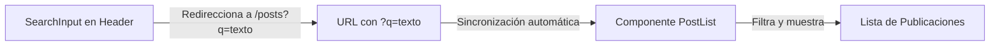

# Módulo 3: Publicaciones, Hilos y Búsqueda (Posts, Threads & Search)

Maneja la creación de posts, el listado con filtros y ordenamiento, la visualización de hilos (conversaciones) y el buscador. Está diseñado para poder integrar cada pieza por separado (el botón para crear posts en un lado y la búsqueda/lista en otro) o usar el contenedor unificado.

---

## API Pública (Exports)

Todos los componentes, hooks y funciones que debes usar se exponen en:
```typescript
import { 
  Module3Container,
  CreatePostProvider, 
  useCreatePost,
  SearchInput,
  PostList,
  PostServiceFactory
} from '@/modules/module_3/exports';
```

---

## Modos de Datos (Mock vs Supabase)

El módulo usa `PostServiceFactory` para decidir de dónde obtiene la información:
- **Modo Mock (Por defecto):** Lee/escribe localmente en el archivo JSON `src/modules/module_3/posts/services/mock-posts-extra.json`. Ideal para desarrollo y pruebas rápidas.
- **Modo Supabase:** Se activa si configuras `NEXT_PUBLIC_SERVICE_TYPE=supabase` y provees las variables de entorno de Supabase (`NEXT_PUBLIC_SUPABASE_URL` y `NEXT_PUBLIC_SUPABASE_ANON_KEY`).

---

## Cómo probar todo el módulo junto (Container)

Si quieres levantar una página de pruebas rápida para ver cómo funciona todo el flujo unificado en una sola pantalla (buscador, botón para crear posts y lista de hilos):

1. Crea un archivo en `src/app/posts/page.tsx` (u otra ruta libre):
```tsx
import { Module3Container } from '@/modules/module_3/exports';

export default function TestPage() {
  return (
    <main className="min-h-screen bg-[#0a0a0a] p-4 sm:p-8">
      {/* Carga el buscador, la lista de hilos y el modal en un solo contenedor */}
      <Module3Container />
    </main>
  );
}
```
2. Inicia el servidor (`npm run dev`) y entra en tu navegador a `http://localhost:3000/posts` para probar los flujos completos.

---

## 1. Integrar el Modal de Creación ("Crear Publicación")

El modal para crear posts se controla de manera global con un contexto (`CreatePostProvider`) para que puedas dispararlo mediante un botón desde la barra de navegación, el perfil o cualquier otra vista sin tener que duplicar lógica.

### Paso 1: Configurar el Proveedor
Envuelve la aplicación (o el layout común) con el provider. Esto inyecta el modal en el árbol de componentes de manera oculta:

```tsx
import { CreatePostProvider } from '@/modules/module_3/exports';

export default function RootLayout({ children }) {
  return (
    <CreatePostProvider>
      {children}
    </CreatePostProvider>
  );
}
```

### Paso 2: Abrir el Modal desde cualquier botón
Usa el hook `useCreatePost` en cualquier componente secundario para mostrar el modal:

```tsx
"use client";

import { useCreatePost } from '@/modules/module_3/exports';

export default function CreateButton() {
  const { open } = useCreatePost();

  return (
    <button 
      onClick={open} 
      className="px-4 py-2 bg-blue-600 hover:bg-blue-700 text-white rounded-lg"
    >
      + Crear Post
    </button>
  );
}
```

---

## 2. Integrar el Buscador y Listado de Posts

El buscador y el listado de posts están desacoplados y se sincronizan a través de la URL (usando `?q=query` y `?filter=filtro`). Esto permite compartir enlaces de búsquedas o filtros específicos directamente.



### Paso 1: Colocar la caja de búsqueda (ej. en el Header)
Importa `SearchInput` y configúralo con el `targetPath` hacia donde quieres enviar la búsqueda. 

> [!NOTE]
> Como `SearchInput` se sincroniza automáticamente con el parámetro `q` de la URL, debe ir envuelto en un bloque `<Suspense>` si se renderiza en componentes o layouts estáticos.

```tsx
import { Suspense } from 'react';
import { SearchInput } from '@/modules/module_3/exports';

export default function Header() {
  return (
    <header className="flex items-center justify-between p-4 bg-black">
      <span>UdoNET</span>
      {/* Envía al usuario a /posts?q=busqueda */}
      <Suspense fallback={<div>Cargando...</div>}>
        <SearchInput targetPath="/posts" placeholder="Buscar en el foro..." />
      </Suspense>
    </header>
  );
}
```

### Paso 2: Renderizar la búsqueda, filtros y vista de hilos en la página de destino
En la página de destino (en este ejemplo, `/posts`), puedes integrar el buscador completo (`SearchBox`), el listado (`PostList`) y la vista de detalles del hilo (`ThreadView`) gestionando un estado local para la navegación. 

> **IMPORTANTE**: Debes envolver los componentes que lean parámetros de búsqueda (como `SearchBox` y `PostList`) en un bloque `<Suspense>` de React. De lo contrario, Next.js arrojará un error de compilación al generar las páginas estáticas.

```tsx
"use client";

import { useState, Suspense } from 'react';
import { SearchBox, PostList, ThreadView } from '@/modules/module_3/exports';

function PostsContent() {
  const [selectedThread, setSelectedThread] = useState<string | null>(null);

  // Si hay un hilo seleccionado, renderiza la vista de conversación
  if (selectedThread) {
    return (
      <main className="max-w-4xl mx-auto p-6">
        <ThreadView threadId={selectedThread} onBack={() => setSelectedThread(null)} />
      </main>
    );
  }

  // De lo contrario, muestra el buscador con filtros y la lista de posts
  return (
    <main className="max-w-4xl mx-auto p-6 space-y-6">
      {/* Buscador completo con select de filtros (más votados, recientes, etc.) */}
      <SearchBox />
      
      <h1 className="text-xl font-bold">Publicaciones</h1>
      
      {/* Lista de posts. Al hacer clic, guarda el ID del hilo para abrirlo */}
      <PostList onSelectPost={(id) => setSelectedThread(id)} />
    </main>
  );
}

export default function PostsPage() {
  return (
    <Suspense fallback={<div className="p-12 text-center text-gray-500">Cargando publicaciones...</div>}>
      <PostsContent />
    </Suspense>
  );
}
```

---

## Persistencia en Modo Mock

Cuando creas un post usando el modal en modo local (Mock), el servidor modifica el archivo `src/modules/module_3/posts/services/mock-posts-extra.json` directamente y utiliza `revalidatePath` para refrescar la lista. Los cambios persisten localmente mientras desarrollas.
